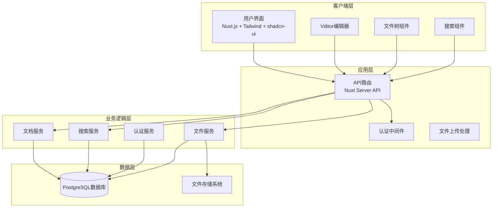

# 设计文档

## 概述

在线知识库系统是一个基于Nuxt.js的全栈Web应用程序，提供安全的单用户Markdown文档管理平台。系统采用现代化的技术栈，包括Nuxt.js作为前端框架，PostgreSQL作为数据存储，Vditor作为Markdown编辑器，实现高性能的文档创建、编辑、组织和搜索功能。

系统设计遵循响应式架构原则，确保快速加载、流畅交互和优秀的用户体验。通过PostgreSQL的全文搜索功能和前端优化策略，系统能够处理大量文档并提供毫秒级的搜索响应。

## 架构

### 系统架构图



### 技术栈选择

**前端技术栈:**
- **Nuxt.js 3**: 提供SSR/SSG能力，优化首屏加载性能
- **Tailwind CSS**: 实用优先的CSS框架，快速构建响应式界面
- **shadcn-ui**: 高质量的Vue组件库，提供一致的设计语言
- **Vditor**: 功能丰富的Markdown编辑器，支持所见即所得编辑

**后端技术栈:**
- **Nuxt Server API**: 内置的服务端API路由系统
- **PostgreSQL**: 关系型数据库，提供强大的全文搜索功能
- **Prisma ORM**: 类型安全的数据库访问层（推荐）

**部署和存储:**
- **文件存储**: 本地文件系统或云存储（如AWS S3）
- **数据库**: PostgreSQL 14+，支持全文搜索和JSON字段

## 组件和接口

### 前端组件架构

#### 1. 布局组件 (Layout Components)

**AppLayout.vue**
```typescript
interface AppLayoutProps {
  showSidebar: boolean
  sidebarCollapsed: boolean
}

interface AppLayoutEmits {
  'toggle-sidebar': void
  'toggle-collapse': void
}
```

**Sidebar.vue**
```typescript
interface SidebarProps {
  collapsed: boolean
  documents: DocumentTreeNode[]
}

interface SidebarEmits {
  'select-document': (documentId: string) => void
  'create-document': (parentId?: string) => void
  'create-folder': (parentId?: string) => void
}
```

#### 2. 编辑器组件 (Editor Components)

**DocumentEditor.vue**
```typescript
interface DocumentEditorProps {
  document: Document | null
  readonly: boolean
}

interface DocumentEditorEmits {
  'save': (content: string) => void
  'auto-save': (content: string) => void
}
```

**VditorWrapper.vue**
```typescript
interface VditorWrapperProps {
  value: string
  options: VditorOptions
  disabled: boolean
}

interface VditorWrapperEmits {
  'input': (value: string) => void
  'focus': void
  'blur': void
}
```

#### 3. 搜索组件 (Search Components)

**SearchBar.vue**
```typescript
interface SearchBarProps {
  placeholder: string
  loading: boolean
}

interface SearchBarEmits {
  'search': (query: string) => void
  'clear': void
}
```

**SearchResults.vue**
```typescript
interface SearchResultsProps {
  results: SearchResult[]
  loading: boolean
  query: string
}

interface SearchResultsEmits {
  'select-result': (documentId: string) => void
}
```

#### 4. 文件树组件 (Tree Components)

**DocumentTree.vue**
```typescript
interface DocumentTreeProps {
  nodes: DocumentTreeNode[]
  selectedId: string | null
  expandedIds: string[]
}

interface DocumentTreeEmits {
  'select': (nodeId: string) => void
  'expand': (nodeId: string) => void
  'collapse': (nodeId: string) => void
  'context-menu': (nodeId: string, event: MouseEvent) => void
}
```

### API接口设计

#### 1. 文档管理API

**GET /api/documents**
```typescript
interface GetDocumentsResponse {
  documents: DocumentTreeNode[]
}
```

**GET /api/documents/[id]**
```typescript
interface GetDocumentResponse {
  document: Document
}
```

**POST /api/documents**
```typescript
interface CreateDocumentRequest {
  title: string
  content?: string
  parentId?: string
  type: 'document' | 'folder'
}

interface CreateDocumentResponse {
  document: Document
}
```

**PUT /api/documents/[id]**
```typescript
interface UpdateDocumentRequest {
  title?: string
  content?: string
  parentId?: string
}

interface UpdateDocumentResponse {
  document: Document
}
```

**DELETE /api/documents/[id]**
```typescript
interface DeleteDocumentResponse {
  success: boolean
}
```

#### 2. 搜索API

**GET /api/search**
```typescript
interface SearchRequest {
  query: string
  limit?: number
  offset?: number
}

interface SearchResponse {
  results: SearchResult[]
  total: number
  query: string
}
```

#### 3. 文件上传API

**POST /api/upload**
```typescript
interface UploadRequest {
  file: File
  documentId?: string
}

interface UploadResponse {
  url: string
  filename: string
  size: number
}
```

#### 4. 认证API

**POST /api/auth/login**
```typescript
interface LoginRequest {
  username: string
  password: string
}

interface LoginResponse {
  token: string
  user: User
}
```

**POST /api/auth/logout**
```typescript
interface LogoutResponse {
  success: boolean
}
```

**GET /api/auth/me**
```typescript
interface MeResponse {
  user: User | null
}
```

## 数据模型

### 数据库架构

#### 1. 用户表 (users)
```sql
CREATE TABLE users (
  id UUID PRIMARY KEY DEFAULT gen_random_uuid(),
  username VARCHAR(50) UNIQUE NOT NULL,
  password_hash VARCHAR(255) NOT NULL,
  email VARCHAR(255),
  created_at TIMESTAMP WITH TIME ZONE DEFAULT NOW(),
  updated_at TIMESTAMP WITH TIME ZONE DEFAULT NOW()
);
```

#### 2. 文档表 (documents)
```sql
CREATE TABLE documents (
  id UUID PRIMARY KEY DEFAULT gen_random_uuid(),
  title VARCHAR(255) NOT NULL,
  content TEXT,
  content_vector TSVECTOR,
  type VARCHAR(20) NOT NULL CHECK (type IN ('document', 'folder')),
  parent_id UUID REFERENCES documents(id) ON DELETE CASCADE,
  path LTREE,
  position INTEGER DEFAULT 0,
  created_at TIMESTAMP WITH TIME ZONE DEFAULT NOW(),
  updated_at TIMESTAMP WITH TIME ZONE DEFAULT NOW(),
  created_by UUID REFERENCES users(id) NOT NULL
);

-- 全文搜索索引
CREATE INDEX documents_content_vector_idx ON documents USING GIN(content_vector);

-- 路径索引
CREATE INDEX documents_path_idx ON documents USING GIST(path);

-- 父子关系索引
CREATE INDEX documents_parent_id_idx ON documents(parent_id);

-- 自动更新content_vector的触发器
CREATE OR REPLACE FUNCTION update_document_search_vector()
RETURNS TRIGGER AS $$
BEGIN
  NEW.content_vector := to_tsvector('english', COALESCE(NEW.title, '') || ' ' || COALESCE(NEW.content, ''));
  RETURN NEW;
END;
$$ LANGUAGE plpgsql;

CREATE TRIGGER update_documents_search_vector
  BEFORE INSERT OR UPDATE ON documents
  FOR EACH ROW EXECUTE FUNCTION update_document_search_vector();
```

#### 3. 文件表 (files)
```sql
CREATE TABLE files (
  id UUID PRIMARY KEY DEFAULT gen_random_uuid(),
  filename VARCHAR(255) NOT NULL,
  original_filename VARCHAR(255) NOT NULL,
  mime_type VARCHAR(100) NOT NULL,
  size INTEGER NOT NULL,
  path VARCHAR(500) NOT NULL,
  document_id UUID REFERENCES documents(id) ON DELETE CASCADE,
  created_at TIMESTAMP WITH TIME ZONE DEFAULT NOW(),
  created_by UUID REFERENCES users(id) NOT NULL
);

CREATE INDEX files_document_id_idx ON files(document_id);
```

#### 4. 会话表 (sessions)
```sql
CREATE TABLE sessions (
  id UUID PRIMARY KEY DEFAULT gen_random_uuid(),
  user_id UUID REFERENCES users(id) ON DELETE CASCADE,
  token VARCHAR(255) UNIQUE NOT NULL,
  expires_at TIMESTAMP WITH TIME ZONE NOT NULL,
  created_at TIMESTAMP WITH TIME ZONE DEFAULT NOW()
);

CREATE INDEX sessions_token_idx ON sessions(token);
CREATE INDEX sessions_user_id_idx ON sessions(user_id);
```

### TypeScript类型定义

```typescript
// 基础类型
interface User {
  id: string
  username: string
  email?: string
  createdAt: Date
  updatedAt: Date
}

interface Document {
  id: string
  title: string
  content?: string
  type: 'document' | 'folder'
  parentId?: string
  path: string
  position: number
  createdAt: Date
  updatedAt: Date
  createdBy: string
}

interface DocumentTreeNode extends Document {
  children: DocumentTreeNode[]
  expanded?: boolean
}

interface SearchResult {
  id: string
  title: string
  content: string
  snippet: string
  rank: number
  path: string
}

interface FileUpload {
  id: string
  filename: string
  originalFilename: string
  mimeType: string
  size: number
  path: string
  documentId?: string
  createdAt: Date
  createdBy: string
}

// Vditor配置类型
interface VditorOptions {
  mode: 'wysiwyg' | 'ir' | 'sv'
  theme: 'classic' | 'dark'
  toolbar: string[]
  upload: {
    url: string
    max: number
    accept: string
  }
  cache: {
    enable: boolean
    id: string
  }
}

// API响应类型
interface ApiResponse<T = any> {
  success: boolean
  data?: T
  error?: string
  message?: string
}
```

## 正确性属性

*属性是一个特征或行为，应该在系统的所有有效执行中保持为真——本质上是关于系统应该做什么的正式声明。属性作为人类可读规范和机器可验证正确性保证之间的桥梁。*

基于需求分析和预工作分析，以下是系统的核心正确性属性：

### 属性 1: 文档持久化一致性
*对于任何*有效的文档内容和元数据，保存操作后从数据库检索的内容应该与原始内容完全一致
**验证需求：需求 1.3, 7.2**

### 属性 2: 编辑器功能完整性
*对于任何*支持的Markdown功能（todolist、图片插入），编辑器应该能够正确处理和渲染这些功能
**验证需求：需求 1.2**

### 属性 3: 文档加载一致性
*对于任何*存在于数据库中的文档，编辑器加载的内容应该与数据库中存储的内容完全一致
**验证需求：需求 1.4**

### 属性 4: 树状视图结构一致性
*对于任何*文档和文件夹的层级结构，树状视图显示的结构应该与数据库中存储的层级关系完全一致
**验证需求：需求 2.1**

### 属性 5: 文件夹操作原子性
*对于任何*文件夹的创建、移动、删除或重命名操作，操作完成后系统状态应该保持一致，所有相关的层级关系都应该正确更新
**验证需求：需求 2.2, 2.3, 2.4, 2.5**

### 属性 6: 全文搜索完整性
*对于任何*搜索查询，搜索结果应该包含所有包含该查询关键词的文档，并且结果应该按相关性排序显示
**验证需求：需求 4.1, 4.2**

### 属性 7: 搜索结果高亮一致性
*对于任何*搜索结果，显示的内容中应该正确高亮所有匹配的关键词实例
**验证需求：需求 4.3**

### 属性 8: 搜索导航正确性
*对于任何*搜索结果项，点击后应该正确导航到对应的文档，并且文档内容应该与搜索结果一致
**验证需求：需求 4.4**

### 属性 9: 认证访问控制
*对于任何*未认证的访问请求，系统应该拒绝访问并重定向到登录页面
**验证需求：需求 6.1**

### 属性 10: 登录凭据验证
*对于任何*登录尝试，系统应该正确验证凭据：正确凭据创建有效会话，错误凭据拒绝访问并显示错误信息
**验证需求：需求 6.2, 6.3**

### 属性 11: 会话生命周期管理
*对于任何*过期的会话，系统应该要求重新认证，不允许使用过期会话访问受保护资源
**验证需求：需求 6.4**

### 属性 12: 图片上传处理完整性
*对于任何*有效的图片文件上传，系统应该成功存储文件并返回可访问的URL，该URL应该能够正确显示图片内容
**验证需求：需求 8.1, 8.2, 8.3**

### 属性 13: 图片格式支持一致性
*对于任何*支持的图片格式（PNG、JPG、GIF、WebP），系统应该能够正确处理上传、存储和显示
**验证需求：需求 8.4**

### 属性 14: 图片优化处理
*对于任何*上传的图片，系统应该进行适当的压缩和优化，优化后的图片文件大小应该小于或等于原始文件
**验证需求：需求 8.5**

## 错误处理

### 1. 数据库连接错误
- **场景**: 数据库不可用或连接超时
- **处理策略**: 实现连接重试机制，显示友好的错误信息，启用离线模式（如果可能）
- **用户体验**: 显示"系统暂时不可用，请稍后重试"的提示

### 2. 文件上传错误
- **场景**: 文件过大、格式不支持、存储空间不足
- **处理策略**: 
  - 前端验证文件大小和格式
  - 后端二次验证并返回具体错误信息
  - 实现分片上传处理大文件
- **用户体验**: 显示具体的错误原因和建议解决方案

### 3. 搜索服务错误
- **场景**: 搜索索引损坏、查询语法错误
- **处理策略**: 
  - 实现搜索索引自动重建机制
  - 查询语法验证和清理
  - 降级到简单文本搜索
- **用户体验**: 显示"搜索暂时不可用"并提供基础搜索功能

### 4. 认证和授权错误
- **场景**: 会话过期、无效token、权限不足
- **处理策略**: 
  - 自动刷新token机制
  - 优雅的登录状态检查
  - 清晰的权限错误提示
- **用户体验**: 自动重定向到登录页面，保存用户当前操作状态

### 5. 编辑器错误
- **场景**: Vditor初始化失败、内容解析错误
- **处理策略**: 
  - 降级到纯文本编辑器
  - 内容自动保存和恢复
  - 编辑器重新初始化机制
- **用户体验**: 显示编辑器状态，提供内容恢复选项

### 6. 网络错误处理
- **场景**: 网络中断、请求超时、服务器错误
- **处理策略**: 
  - 实现请求重试机制
  - 离线状态检测
  - 本地缓存和同步机制
- **用户体验**: 显示网络状态，提供离线编辑功能

## 测试策略

### 双重测试方法

系统采用单元测试和基于属性的测试相结合的综合测试策略：

**单元测试**：
- 验证特定示例、边缘情况和错误条件
- 测试组件集成点
- 验证具体的业务逻辑实现
- 重点关注：
  - 特定的用户交互场景
  - API端点的具体输入输出
  - 错误处理的具体情况
  - UI组件的特定状态

**基于属性的测试**：
- 验证跨所有输入的通用属性
- 通过随机化实现全面的输入覆盖
- 重点关注：
  - 数据一致性属性
  - 系统不变量
  - 业务规则的通用性
  - 边界条件的自动发现

### 基于属性的测试配置

**测试框架选择**: 使用 `fast-check` 库进行JavaScript/TypeScript的基于属性的测试

**测试配置要求**：
- 每个属性测试最少运行100次迭代（由于随机化需要）
- 每个属性测试必须引用其设计文档属性
- 标签格式：**Feature: online-knowledge-base, Property {number}: {property_text}**
- 每个正确性属性必须由单个基于属性的测试实现

**测试覆盖范围**：
- **数据层测试**: 数据库操作的一致性和完整性
- **API层测试**: 请求响应的正确性和错误处理
- **业务逻辑测试**: 核心功能的正确性属性
- **集成测试**: 组件间交互的正确性

### 测试实现示例

```typescript
// 示例：属性测试配置
import fc from 'fast-check';

// Feature: online-knowledge-base, Property 1: 文档持久化一致性
test('document persistence consistency', () => {
  fc.assert(fc.property(
    fc.record({
      title: fc.string({ minLength: 1, maxLength: 255 }),
      content: fc.string(),
      type: fc.constantFrom('document', 'folder')
    }),
    async (document) => {
      const saved = await saveDocument(document);
      const retrieved = await getDocument(saved.id);
      
      expect(retrieved.title).toBe(document.title);
      expect(retrieved.content).toBe(document.content);
      expect(retrieved.type).toBe(document.type);
    }
  ), { numRuns: 100 });
});
```

### 性能测试策略

虽然不在核心属性测试范围内，但系统需要满足以下性能要求：
- **首屏加载时间**: < 3秒
- **文档切换时间**: < 1秒  
- **搜索响应时间**: < 500毫秒
- **文件上传处理**: 支持最大10MB文件

这些性能要求将通过专门的性能测试工具（如Lighthouse、WebPageTest）进行验证。

### 测试数据管理

- **测试数据隔离**: 每个测试使用独立的数据库事务
- **数据清理**: 测试完成后自动清理生成的测试数据
- **种子数据**: 提供一致的基础测试数据集
- **随机数据生成**: 使用fast-check生成多样化的测试输入